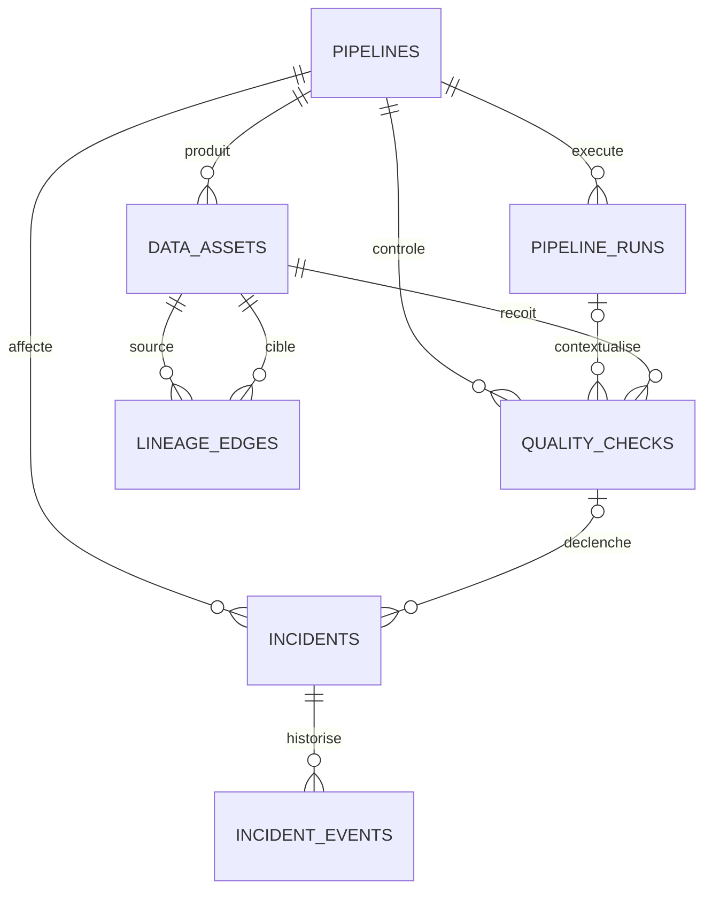

# Modèle de données commun

## Objectif

Le schéma `observability` normalise les métadonnées de pipelines différents.
Les connecteurs futurs traduiront leurs sources vers ce modèle sans ajouter de
logique spécifique au cœur de la plateforme.

## Relations

## Tables

### `pipelines`

Référentiel des pipelines supervisés. `pipeline_key` est l'identifiant stable
et unique utilisé par les connecteurs.

### `pipeline_runs`

Historique normalisé des exécutions. L'unicité de
`(pipeline_id, external_run_id)` assure l'idempotence d'une collecte.

Les volumes sont optionnels, car une source peut ne pas les fournir. Lorsqu'ils
sont présents, ils ne peuvent pas être négatifs.

### `data_assets`

Référentiel des tables, fichiers, flux ou autres actifs d'un pipeline. Le couple
`(pipeline_id, external_asset_id)` est unique.

### `quality_checks`

Résultats de contrôles reliés à un actif et éventuellement à une exécution.
L'état `not_measured` distingue explicitement une absence de mesure d'un succès.

`observed_value` et `expected_rule` sont structurés en JSON afin de représenter
plusieurs familles de contrôles sans perdre leur preuve d'origine.

### `incidents`

État courant d'un incident. L'origine de l'impact est qualifiée comme mesurée,
déclarée ou inconnue.

### `incident_events`

Historique append-only prévu pour les changements d'état et actions associées à
un incident. Cette table technique satisfait l'exigence de traçabilité du
contrat fonctionnel.

### `lineage_edges`

Relation orientée entre deux actifs. Une auto-référence est interdite et chaque
relation conserve son origine de preuve.

## Principes d'intégrité

- identifiants internes UUID ;
- identifiants externes conservés pour la traçabilité ;
- suppression en cascade non autorisée dans le modèle initial ;
- périodes de fin toujours postérieures ou égales au début ;
- volumes non négatifs ;
- règles d'énumération contrôlées par PostgreSQL ;
- migrations Alembic explicites et réversibles.

## Limites du Sprint 1

Le modèle ne fixe pas encore :

- le mapping des colonnes Mobility ;
- la taxonomie définitive des types d'actifs ;
- les politiques de rétention ;
- les règles automatiques d'ouverture ou de clôture d'incidents ;
- le calcul d'un score agrégé de qualité.

Ces éléments dépendent de preuves ou de décisions prévues dans les sprints
suivants.
